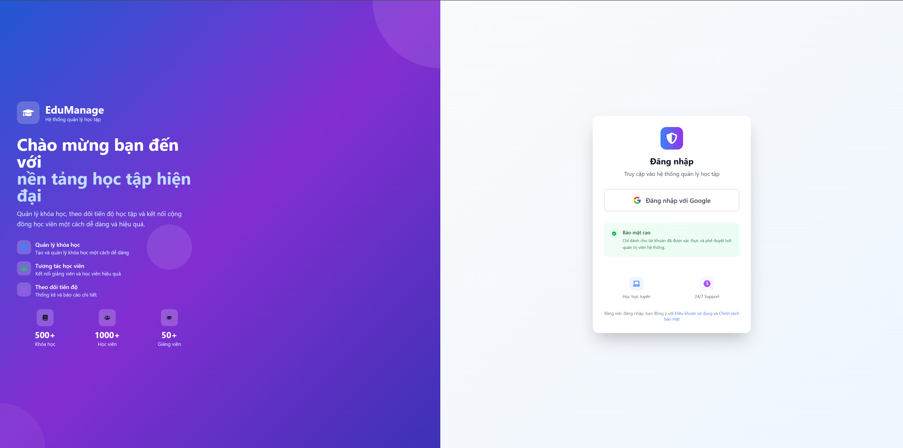
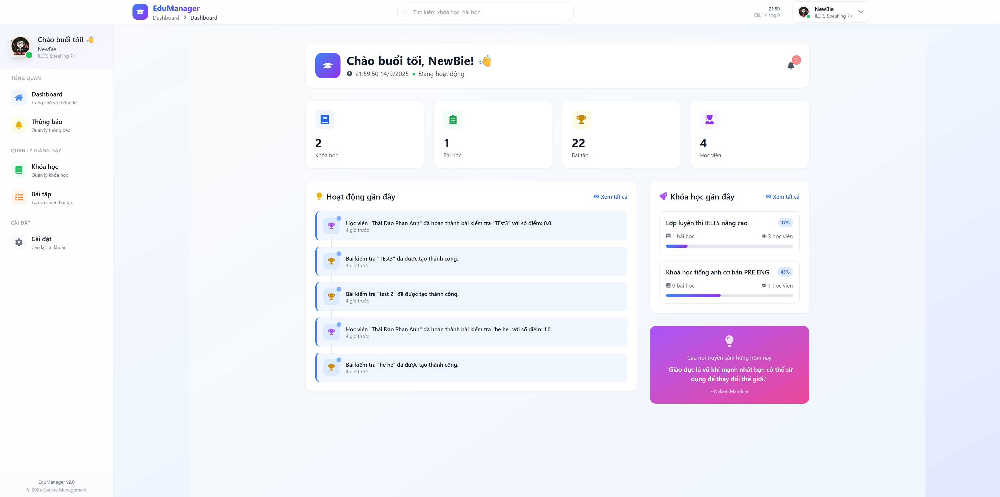
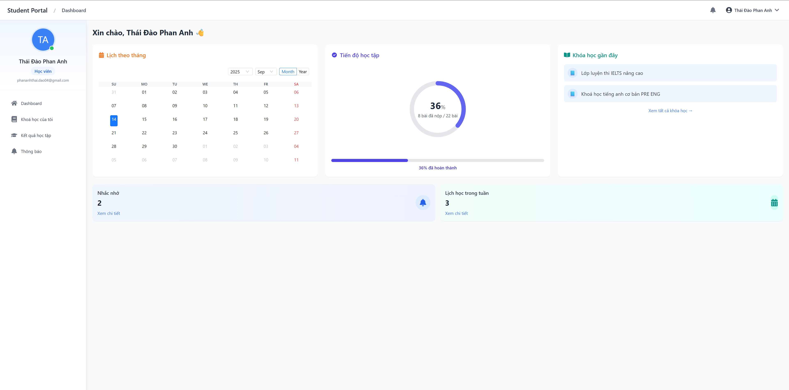
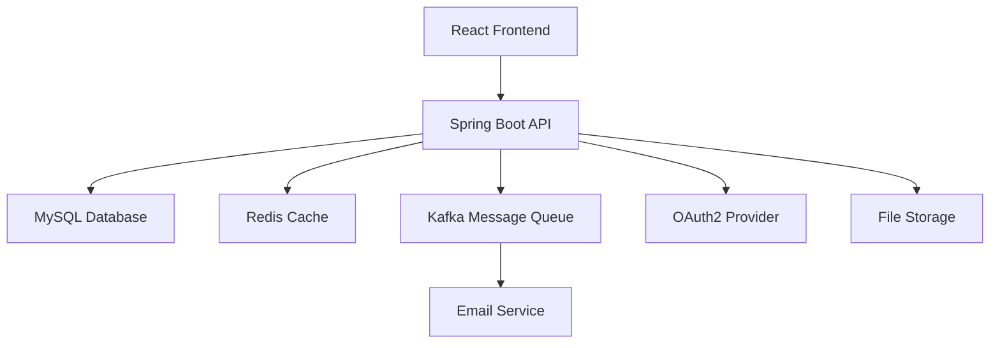

# 🎓 CoursesEnglish Learning Platform

<div align="center">


</div>

<p align="center">
  <strong>A comprehensive web application for English course management, featuring student and teacher interfaces, exam management, automated grading, and real-time notifications.</strong>
</p>

---

## 📸 Screenshots

### 🔐 Login Page


### 👩‍🏫 Teacher Dashboard


### 👨‍🎓 Student Dashboard


---

## 📋 Table of Contents
- [📸 Screenshots](#-screenshots)
- [✨ Features](#-features)
- [🏗 Architecture](#-architecture)
- [🛠 Technology Stack](#-technology-stack)
- [🚀 Getting Started](#-getting-started)
    - [📋 Prerequisites](#-prerequisites)
    - [⚙️ Backend Setup](#️-backend-setup)
    - [🎨 Frontend Setup](#-frontend-setup)
- [🔧 Environment Configuration](#-environment-configuration)
- [📚 API Documentation](#-api-documentation)
- [📁 Directory Structure](#-directory-structure)
- [📊 Analytics](#-analytics)
- [🤝 Contributing](#-contributing)
- [📄 License](#-license)

## ✨ Features

<table>
<tr>
<td width="50%">

### 🔐 **Authentication & Security**
- OAuth2 integration with Google
- JWT-based authentication
- Role-based access control
- Secure password handling

### 👨‍🎓 **Student Features**
- Course enrollment & management
- Interactive exam taking
- Real-time progress tracking
- Performance analytics
- Notification system

</td>
<td width="50%">

### 👩‍🏫 **Teacher Features**
- Course creation & management
- Exam builder with multiple question types
- Student performance monitoring
- Automated grading system
- Bulk operations support

### 🛠 **System Features**
- Real-time notifications via Kafka
- Redis caching for performance
- Responsive design
- File upload support
- Email notifications

</td>
</tr>
</table>

## 🏗 Architecture

<div align="center">



</div>

**Modern Microservices Architecture:**
- 🖥️ **Frontend**: React with Vite for fast development
- 🔧 **Backend**: Spring Boot 3 RESTful API
- 💾 **Database**: MySQL for persistent storage
- ⚡ **Cache**: Redis for performance optimization
- 📨 **Message Queue**: Kafka for async processing
- 🔐 **Authentication**: OAuth2 with JWT tokens

## 🛠 Technology Stack

<div align="center">

### Backend Technologies


### Frontend Technologies


</div>

### 📦 Backend Stack
- **☕ Java 21** - Latest LTS version
- **🚀 Spring Boot 3.x** - Modern Spring framework
- **🔒 Spring Security** - OAuth2 authentication
- **📊 Spring Data JPA** - Database abstraction
- **💾 MySQL 8.0** - Relational database
- **⚡ Redis** - In-memory caching
- **📨 Apache Kafka** - Message streaming
- **🐳 Docker & Docker Compose** - Containerization

### 🎨 Frontend Stack
- **⚛️ React 18** - Modern UI library
- **⚡ Vite 7** - Fast build tool
- **🛣️ React Router 7** - Client-side routing
- **🎨 Tailwind CSS** - Utility-first CSS
- **🐜 Ant Design** - Enterprise UI components
- **🔄 React Query** - Server state management
- **📡 Axios** - HTTP client
- **📝 React Hook Form** - Form validation with Zod

## 🚀 Getting Started

### 📋 Prerequisites

<table>
<tr>
<td width="50%">

**Required Software:**
- ☕ Java 21 JDK
- 📦 Node.js 19+ and npm
- 🐳 Docker and Docker Compose
- 📂 Git

</td>
<td width="50%">

**System Requirements:**
- 💾 4GB RAM minimum
- 💿 2GB free disk space
- 🌐 Internet connection
- 🖥️ Modern web browser

</td>
</tr>
</table>

### ⚙️ Backend Setup

```bash
# 1️⃣ Clone the repository
git clone https://github.com/Newbie1402/CoursesEnglish.git
cd CoursesEnglish

# 2️⃣ Start infrastructure services
cd BE_Courses
docker-compose up -d

# 3️⃣ Create environment file (.env)
# See Environment Configuration section below
```

**🔧 IDE Setup (Recommended):**
```bash
# Install EnvFile plugin in IntelliJ IDEA
# 1. Paste .env file into BE_Courses folder
# 2. Run → Edit Configurations
# 3. Click CoursesApplication → Enable EnvFile
# 4. Add .env file to configuration
# 5. Apply and run
```

**🏃‍♂️ Alternative - Maven run:**
```bash
./mvnw spring-boot:run
```

### 🎨 Frontend Setup

```bash
# 1️⃣ Navigate to frontend directory
cd FE_Courses

# 2️⃣ Install dependencies
npm install

# 3️⃣ Start development server
npm run dev

# 4️⃣ Open browser
# Application available at: http://localhost:5173
```

## 🔧 Environment Configuration

### 🌟 Backend Environment (.env)
```env
# 🗄️ Database Configuration
DB_URL=jdbc:mysql://localhost:3306/course_db
DB_USERNAME=root
DB_PASSWORD=verysecret

# 🔐 Security Configuration
JWT_SECRET=your_jwt_secret_key_here
ADMIN_EMAIL=admin@example.com

# 🔑 OAuth2 Configuration
GOOGLE_CLIENT_ID=your_google_client_id
GOOGLE_CLIENT_SECRET=your_google_client_secret

# 📧 Email Configuration
MAIL_USERNAME=your_email@gmail.com
MAIL_PASSWORD=your_email_app_password

# ☁️ Cloud Services
S3_ACCESS_KEY=your_aws_access_key
S3_SECRET=your_aws_secret_key
CLOUDINARY_CLOUD_NAME=your_cloud_name
CLOUDINARY_API_KEY=your_cloudinary_api_key
CLOUDINARY_API_SECRET=your_cloudinary_api_secret

# 🌐 Frontend URL
FRONTEND_URL=http://localhost:5173
```

### 🐳 Infrastructure Services
Our Docker Compose setup includes:
- **🗄️ MySQL** - Primary database
- **⚡ Redis** - Caching layer
- **📨 Kafka & Zookeeper** - Message streaming
- **📊 Kafdrop & Kafka UI** - Monitoring tools

## 📚 API Documentation

<div align="center">

**📖 Interactive API Documentation**

When the backend server is running, access:
- **Swagger UI**: `http://localhost:8080/swagger-ui.html`
- **API Docs**: `http://localhost:8080/v3/api-docs`

</div>

## 📁 Directory Structure

```
CoursesEnglish/
├── 📄 README.md
├── 📁 BE_Courses/               # Spring Boot backend
│   ├── 🐳 docker-compose.yaml   # Infrastructure services
│   ├── 🐳 Dockerfile            # Backend containerization
│   ├── 📦 pom.xml               # Maven dependencies
│   └── 📁 src/                  # Source code
│       ├── 📁 main/
│       │   ├── ☕ java/         # Java application code
│       │   └── 📋 resources/    # Configuration files
│       └── 🧪 test/             # Test cases
├── 📁 FE_Courses/               # React frontend
│   ├── 📦 package.json          # NPM dependencies
│   ├── 🌐 index.html            # Entry HTML
│   ├── 📁 src/                  # Source code
│   │   ├── 🧩 components/       # Reusable UI components
│   │   ├── 🏗️ contexts/         # React contexts
│   │   ├── 📐 layouts/          # Page layouts
│   │   ├── 📄 pages/            # Application pages
│   │   ├── 🔧 services/         # API services
│   │   └── 🛣️ routes/           # Route definitions
│   └── 📁 public/               # Static files
└── 📁 Img/                      # Screenshots and images
    ├── 🖼️ page.png
    ├── 🖼️ teacher.png
    └── 🖼️ student.png
```

## 📊 Analytics

<div align="center">


</div>

## 🤝 Contributing

<div align="center">

**We welcome contributions! Here's how you can help:**


</div>

### 🔄 How to Contribute

1. **🍴 Fork** the repository
2. **🌿 Create** your feature branch (`git checkout -b feature/amazing-feature`)
3. **💾 Commit** your changes (`git commit -m 'Add some amazing feature'`)
4. **📤 Push** to the branch (`git push origin feature/amazing-feature`)
5. **🔀 Open** a Pull Request

### 📝 Contribution Guidelines
- Follow the existing code style
- Write meaningful commit messages
- Add tests for new features
- Update documentation as needed

## 📄 License

<div align="center">

This project is licensed under the **MIT License** - see the [LICENSE](LICENSE) file for details.


---

<p align="center">
  <strong>Made with ❤️ by the CoursesEnglish Team</strong>
</p>

<p align="center">
  <a href="#-coursesenglish-learning-platform">⬆️ Back to top</a>
</p>

</div>
